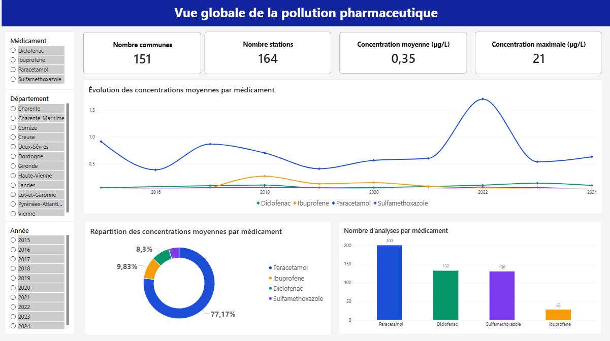
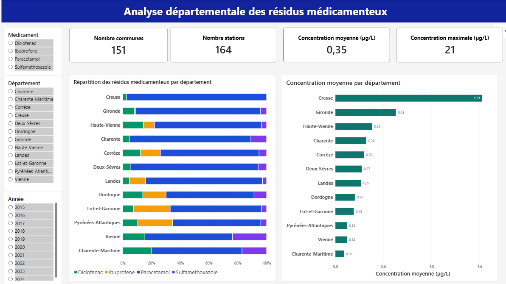
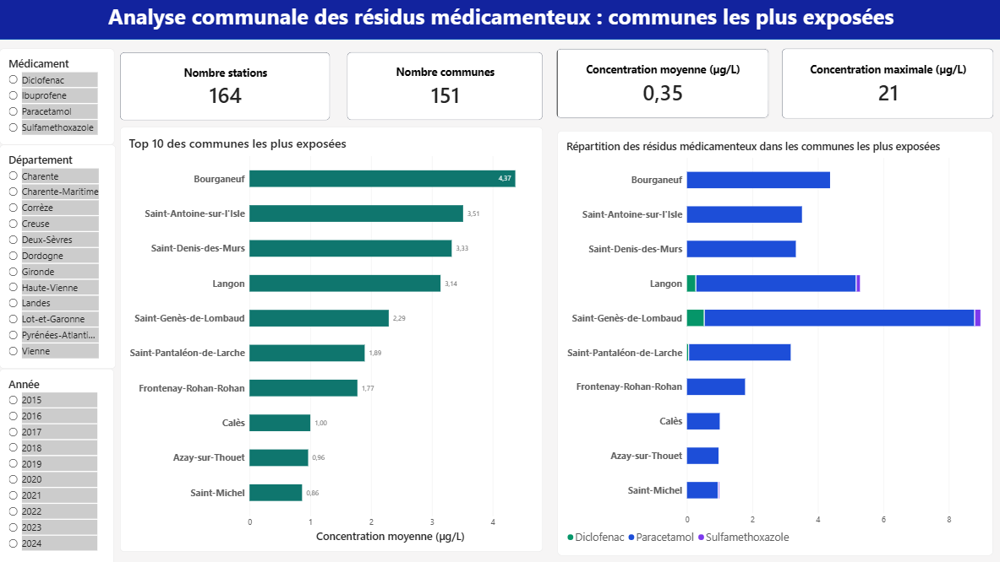

# Surveillance des résidus médicamenteux dans les eaux de surface en Nouvelle-Aquitaine

## Problématique métier

Les résidus médicamenteux sont de plus en plus détectés dans les milieux aquatiques. Les stations d’épuration conventionnelles ne permettent pas d’éliminer efficacement ces micropolluants, favorisant leur persistance dans l’environnement et créant des risques écologiques à long terme.

L’analyse des données de surveillance environnementale reste complexe en raison :
- du grand volume de mesures ;
- de l’hétérogénéité spatiale des concentrations ;
- de l’irrégularité des campagnes d’échantillonnage ;
- et de la diversité des substances surveillées.

Les acteurs de la gestion de l’eau ont donc besoin d’outils permettant :
- d’identifier les zones les plus exposées ;
- de suivre l’évolution des concentrations ;
- et de faciliter l’interprétation territoriale des données environnementales.
  ## Solution proposée

Développement d’un dashboard interactif de surveillance environnementale à partir des données ouvertes NAIADES afin d’explorer les dynamiques de contamination pharmaceutique dans les eaux de surface de Nouvelle-Aquitaine.

Le projet combine Python et Power BI pour :
- nettoyer et structurer les données environnementales ;
- analyser les concentrations de plusieurs résidus médicamenteux ;
- explorer les tendances temporelles et spatiales ;
- comparer les niveaux de contamination entre territoires ;
- et transformer des données complexes en indicateurs d’aide à la décision.

L’étude couvre :
- 164 stations de surveillance ;
- 151 communes ;
- une période de suivi de 10 ans (2015–2024).
  
  ## Technologies mobilisées

- Python
- Pandas
- Power BI
- Analyse spatio-temporelle
- Visualisation de données

   ## Principaux enseignements

- Le paracétamol représente environ 77 % des concentrations moyennes observées.
- La Creuse présente les concentrations départementales moyennes les plus élevées (~1,53 µg/L).
- Bourganeuf apparaît parmi les communes les plus exposées avec une concentration moyenne supérieure à 4 µg/L.
- Les profils de contamination varient selon les territoires, suggérant des dynamiques locales différenciées.
- Les tendances temporelles montrent des fluctuations importantes des concentrations selon les années et les molécules surveillées.

## Vue globale de la pollution pharmaceutique

---

## Analyse départementale des résidus médicamenteux

---

## Analyse communale des résidus médicamenteux

  ## Impacts mesurables

Le projet permet d’identifier rapidement les territoires présentant les concentrations les plus élevées de résidus médicamenteux en Nouvelle-Aquitaine.

L’analyse met notamment en évidence :
- la Creuse comme département présentant les concentrations moyennes les plus élevées (~1,53 µg/L) ;
- la Gironde et la Haute-Vienne parmi les territoires les plus exposés ;
- Bourganeuf comme commune présentant les concentrations moyennes les plus importantes (>4 µg/L).

Le dashboard permet également :
- de comparer les profils de contamination entre communes et départements ;
- d’identifier les substances dominantes selon les territoires ;
- de suivre l’évolution des concentrations entre 2015 et 2024 ;
- et d’explorer les dynamiques spatiales et temporelles de contamination.

Le projet centralise :
- 10 années de données environnementales ;
- 164 stations de surveillance ;
- 151 communes ;
- 4 médicaments(paracétamol, ibuprofene, diclofenac et sulfamethoxazole parmis les plus utilisés issus des données ouvertes NAIADES.

Le dasboard facilite ainsi :
- l’exploration interactive des données environnementales ;
- l’identification des zones prioritaires ;
- et l’aide à la décision pour la surveillance de la qualité des eaux.

   ## Limites de l’analyse

Plusieurs limites méthodologiques doivent être prises en compte dans l’interprétation des résultats :

- Les fréquences d’échantillonnage sont irrégulières selon les années et les stations de surveillance ;
- Certaines molécules ont bénéficié d’un nombre d’analyses plus important que d’autres en particulier le paracétamol;
- Certaines périodes comportent plus de mesures exploitables par rapport d'autres;
- Les données non quantifiables ou hors domaine de validité ont été exclues après nettoyage ;
- La représentativité spatiale des stations varie selon les territoires étudiés.

Ainsi, les tendances observées peuvent refléter :
- des variations réelles de contamination ;
- mais également des différences dans l’effort de surveillance environnementale.

Les résultats doivent donc être interprétés avec prudence et non comme une évaluation réglementaire exhaustive de la qualité des eaux.
